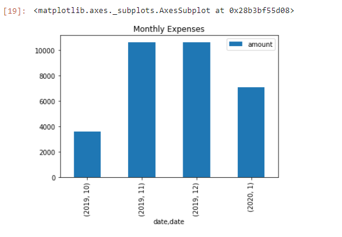
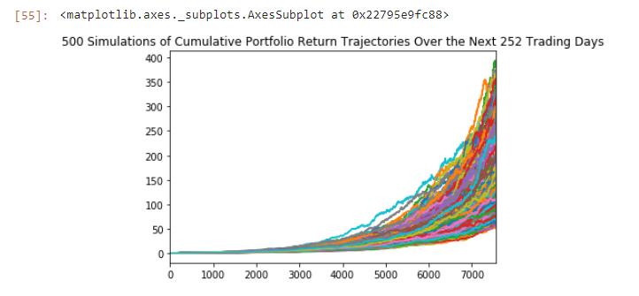
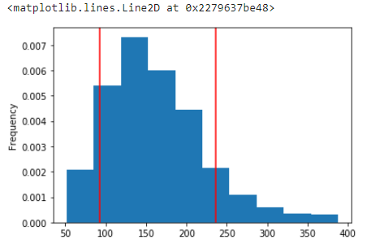

# Financial Planner
## James Phalen

### Using API technologies an analysis of spending and income was conducted from Plaid data.

### A hypothetical portfolio of the SP500 index and the Bloomberg Barclays Aggregate Bond Index was created to represent a retirement account.

## Monthly Expenses

## Monte-Carlo Simulation
### **Assumptions**
1. The horizon is 30 years
1. 500 simulations were run
1. The portfolio weight was 60% SPY and 40% AGG
1. The measure is cummulative returns 

## Confidence Interval
### **Assumptions**
1. Same as above for Monte-Carlo
1. 90% interval meaning that 90% of the results will be between 92.78 and 236.35  

## Conclusions
1. Given an initial $20,000 investment, the expected portfolio return at the 10th percentile is $375,342, at the 20th percentile is $566,414, and at the 90th percentile is $858,950, given last years prices

